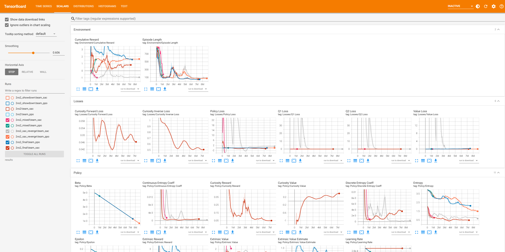
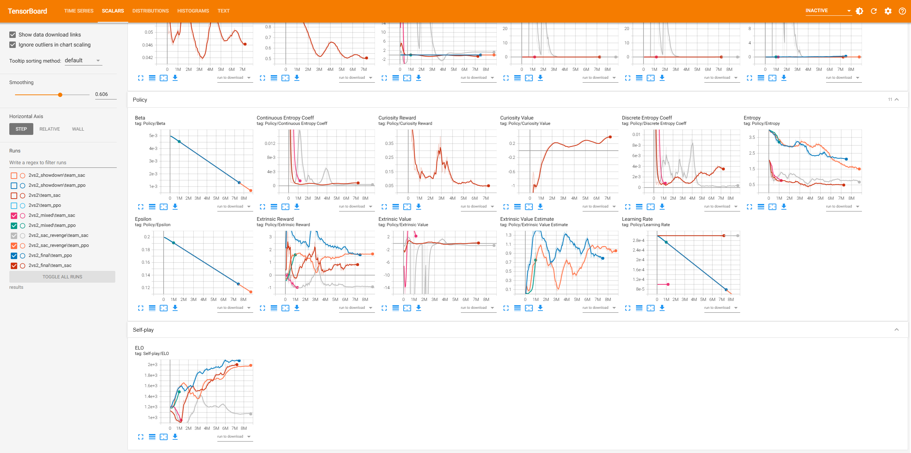

# Snowball Fight 2vs2: Hybrid Agent Competitive Training

This project implements a high-intensity 2vs2 competitive training environment in Unity using ML-Agents. It features a unique Hybrid Action Space where two distinct reinforcement learning algorithms compete against each other in a tactical snowball fight.

team_ppo vs team_ppo

team_ppo vs team_sac

team_sac vs team_sac

## Final Results
After extensive training (approx. 20 hours / 7 million steps), both teams achieved "Superhuman" performance levels:
- Team PPO (Discrete): Reached 2100+ Elo. Demonstrated extreme precision and efficient "snap-to-target" combat logic.
- Team SAC (Continuous): Reached 2000+ Elo. Evolved sophisticated maneuverability and tactical flanking behaviors.

## Technical Architecture

### 1. Hybrid Action Space
- Team PPO (Purple): Utilizes a Discrete Action Space (Movement: 4 directions; Rotation: Left/Right; Fire: On/Off).
- Team SAC (Blue): Utilizes a Continuous Action Space for smooth, analog-like movement and rotation, combined with a discrete trigger for shooting.

### 2. Key Innovations & Optimizations
To overcome early training stagnation and "Learned Helplessness" in the continuous agents, the following optimizations were implemented:
- Radar Observation System: Expanded vector observations (from 15 to 18) to include relative normalized coordinates of the closest enemy, giving agents a "global sense" of threats beyond their raycast vision.
- Aggression Reward Shaping: Introduced a +0.3 Hit Reward for every successful snowball strike, encouraging agents to prioritize engagement over passive hiding.
- Anti-Clumping Logic: Implemented a proximity penalty to discourage agents from getting stuck/clumped together, forcing them to maintain tactical distance (kiting).
- Maximum Entropy Exploration: Leveraged SAC's entropy-driven exploration and added Curiosity (ICM) to break through strategic deadlocks.

## Environment Specs
- Teams: 2 vs 2.
- Health System: 2 HP per agent (2 hits to eliminate).
- Map: 12x12 arena with 6 tilted cube shelters providing tactical cover.
- Winning Condition: Full elimination of the opposing team.

## Training Insights
The project demonstrated a classic RL Arms Race:
1. Early Stage: PPO dominated due to the simplicity of discrete actions.
2. Mid Stage: SAC suffered from "Defensive Collapse" where it only learned to hide.
3. Late Stage: After implementing Radar and Hit Rewards, SAC achieved a "Breakthrough," mastering continuous-space maneuvers to challenge the PPO "Aim Gods," eventually resulting in a stable Nash Equilibrium with both agents above 2000 Elo.

## Training Curves
The following charts illustrate the training progress and the successful "Arms Race" between the 3 models over several days of continuous training:

## How to Run
1. Open the Unity project and load the 2vs2 competitive scene.
2. Ensure Behavior Parameters Space Size is set to 18.
3. Load team_ppo.onnx and team_sac.onnx into their respective agents.
4. Set Behavior Type to Inference Only and press Play to witness the Grandmaster-level showdown.
